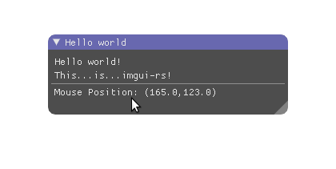

# imgui-rs: Rust bindings for Dear ImGui

[](https://github.com/imgui-rs/imgui-rs/actions)
[](https://crates.io/crates/imgui)
[](https://docs.rs/imgui)
[](https://github.com/ocornut/imgui)



```rust
ui.window("Hello world")
    .size([300.0, 100.0], Condition::FirstUseEver)
    .build(|| {
        ui.text("Hello world!");
        ui.text("こんにちは世界！");
        ui.text("This...is...imgui-rs!");
        ui.separator();
        let mouse_pos = ui.io().mouse_pos;
        ui.text(format!(
            "Mouse Position: ({:.1},{:.1})",
            mouse_pos[0], mouse_pos[1]
        ));
    });
```

`imgui-rs` are the Rust bindings to [Dear ImGui](https://github.com/ocornut/imgui), the standard immediate mode user interface library.

## Main library crates

The core of imgui-rs consists of:

- [`imgui`](./imgui): High-level safe API
- [`imgui-sys`](./imgui-sys): Low-level unsafe API (automatically generated)

Next, we provide an example renderer, and two example backend platform implementations:

- [`imgui-glow-renderer`](https://github.com/imgui-rs/imgui-glow-renderer): Renderer implementation that uses the `glow` crate
- [`imgui-winit-support`](https://github.com/imgui-rs/imgui-winit-support): Backend platform implementation that uses the `winit` crate
- [`imgui-sdl2-support`](https://github.com/imgui-rs/imgui-sdl2-support): Backend platform using SDL2

Each of these contain an `examples` folder showing their usage. Check
their respective `Cargo.toml` to find compatible versions (e.g
`imgui-glow-renderer/Cargo.toml` the `[dependencies]` describes the
compatible `glow` version and `[dev-dependencies]` describes the
compatible `glutin` version)

See below as well for community lead platform and renderer crates.

## Features

- Bindings for Dear ImGui that can be used with safe Rust. Note: API coverage
  is not 100%, but will keep improving over time.
- Builder structs for use cases where the original C++ library uses optional
  function parameters
- Easy integration with `glow` and community integrations with `wgpu` and `glium`
- Easy integration with `winit` and `sdl2`
- Optional support for the freetype font rasterizer and the docking branch

## Minimum Support Rust Version (MSRV)

The MSRV for `imgui-rs` and all of the backend crates is **1.82**. We update our MSRV periodically, and issue a minor bump for it.

## Choosing a backend platform and a renderer

Almost every application that uses imgui-rs needs two additional components in
addition to the main `imgui` crate: a backend platform, and a renderer.

**imgui-rs is not tied to any particular renderer or platform.**

The backend platform is responsible for integrating imgui-rs with the operating
system and its window management. Its responsibilities include the following:

- Handling input events (e.g. keyboard, mouse) and updating imgui-rs state
  accordingly
- Passing information about the OS window (e.g. size, DPI factor) to imgui-rs
- Updating the OS-side mouse cursor when imgui-rs requests it

The renderer is responsible for taking generic, renderer-agnostic _draw lists_
generated by imgui-rs, and rendering them using some graphics API. Its
responsibilities include the following:

- Rendering using vertex/index buffers and command lists
- Handling of DPI factors and scissor rects
- Texture management

We provide the following renderer as an official source (ie, they will always be up to date and working): `imgui-glow-renderer`.

Additionally, we provide the following backends as an official source (ie, they will always be up to date and working): `imgui-winit-support` and `imgui-sdl2-support`.

The most tested platform/renderer combination is `imgui-glow-renderer` +
`imgui-winit-support` + `winit`, but this is not the only possible
combination.

Additionally, there are other libraries which provide other kinds of renderers, which may be out of date with `imgui-rs` releases, but might work well for your use case:

1.  [`imgui-wgpu`](https://github.com/Yatekii/imgui-wgpu-rs)
2.  [`imgui-d3d12-renderer`](https://github.com/curldivergence/imgui-d3d12-renderer)
3.  [`imgui-dx11-renderer`](https://github.com/veykril/imgui-dx11-renderer)
4.  [`imgui-gfx-renderer`](https://github.com/imgui-rs/imgui-gfx-renderer): Deprecated (no longer maintained beyond imgui-rs v0.8). Renderer implementation that uses the `gfx` crate (_not the new gfx-hal crate_)
5.  [`imgui-glium-renderer`](https://github.com/imgui-rs/imgui-glium-renderer): Deprecated implementation that uses the `glium` crate
6.  Many more can be found on [crates.io](https://crates.io) either using search or the ["dependents" page](https://crates.io/crates/imgui/reverse_dependencies) (the "depends on" text indicates if the crate has been updated for current versions of imgui-rs)

You can also write your own support code if you have a more advanced use case, because **imgui-rs is not tied to any specific graphics / OS API**.

## Compiling and running the demos

Examples for `imgui` are in their own crate [`imgui-examples`](https://github.com/imgui-rs/imgui-examples).

```bash
git clone https://github.com/imgui-rs/imgui-examples
cd imgui-examples

# At the reposity root
cargo test

cargo run --example hello_world
cargo run --example test_window
cargo run --example test_window_impl
```

## Windows Platform Notes

Windows platform users will need to use the _MSVC ABI_ version of the Rust
compiler along with its associated
[dependencies](https://www.rust-lang.org/en-US/downloads.html#win-foot) to
build this libary and run the examples.

## How to contribute

1. Change or add something
2. Make sure you're using the latest stable Rust
3. Run rustfmt to guarantee code style conformance

   ```bash
   rustup component add rustfmt
   cargo fmt
   ```

4. Open a pull request in Github

## License

Licensed under either of

- Apache License, Version 2.0, ([LICENSE-APACHE](LICENSE-APACHE) or https://www.apache.org/licenses/LICENSE-2.0)
- MIT license ([LICENSE-MIT](LICENSE-MIT) or https://opensource.org/licenses/MIT)

at your option.

Uses [Dear ImGui](https://github.com/ocornut/imgui) and
[cimgui](https://github.com/cimgui/cimgui).

### Contribution

Unless you explicitly state otherwise, any contribution intentionally submitted
for inclusion in the work by you, as defined in the Apache-2.0 license, shall
be dual licensed as above, without any additional terms or conditions.
